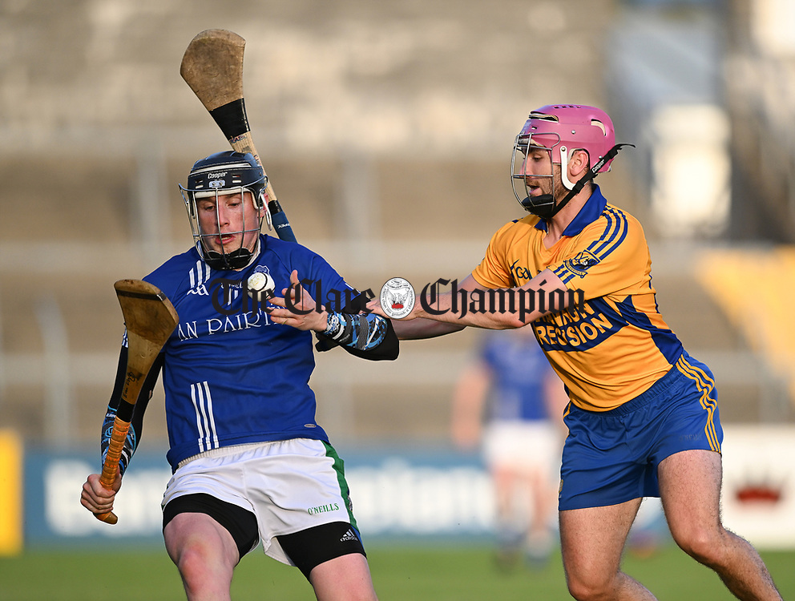

Thanks for taking the time to visit! I'm Cathaoir Agnew, a passionate and dedicated researcher and engineer with a strong background in Computer Vision, Deep Learning and Artificial Intelligence. 

### Education
- PhD in Artificial Intelligence & Machine Learning from the [University of Limerick](https://www.ul.ie/)
- MSc in [Artificial Intelligence & Machine Learning](https://www.ul.ie/gps/artificial-intelligence-machine-learning-msc) from the University of Limerick
- BSc in [Financial Mathematics](https://www.ul.ie/courses/bachelor-science-financial-mathematics) from the University of Limerick

### Outside of Work
When I'm not working, you'll often find me training for sports, primarily [Hurling](https://en.wikipedia.org/wiki/Hurling) and [Handball](https://en.wikipedia.org/wiki/Gaelic_handball) (both traditional Irish sports). I also enjoy hiking and attending concerts and comedy gigs. These activities keep me active and balanced, allowing me to recharge and return to my professional life with renewed energy and focus.

{: style="width: 50%" margin-left:auto; margin-right:auto"}
Source: The Clare Champion

<figure style="text-align: center;">
  
  <figcaption>Source: The Clare Champion</figcaption>
</figure>

